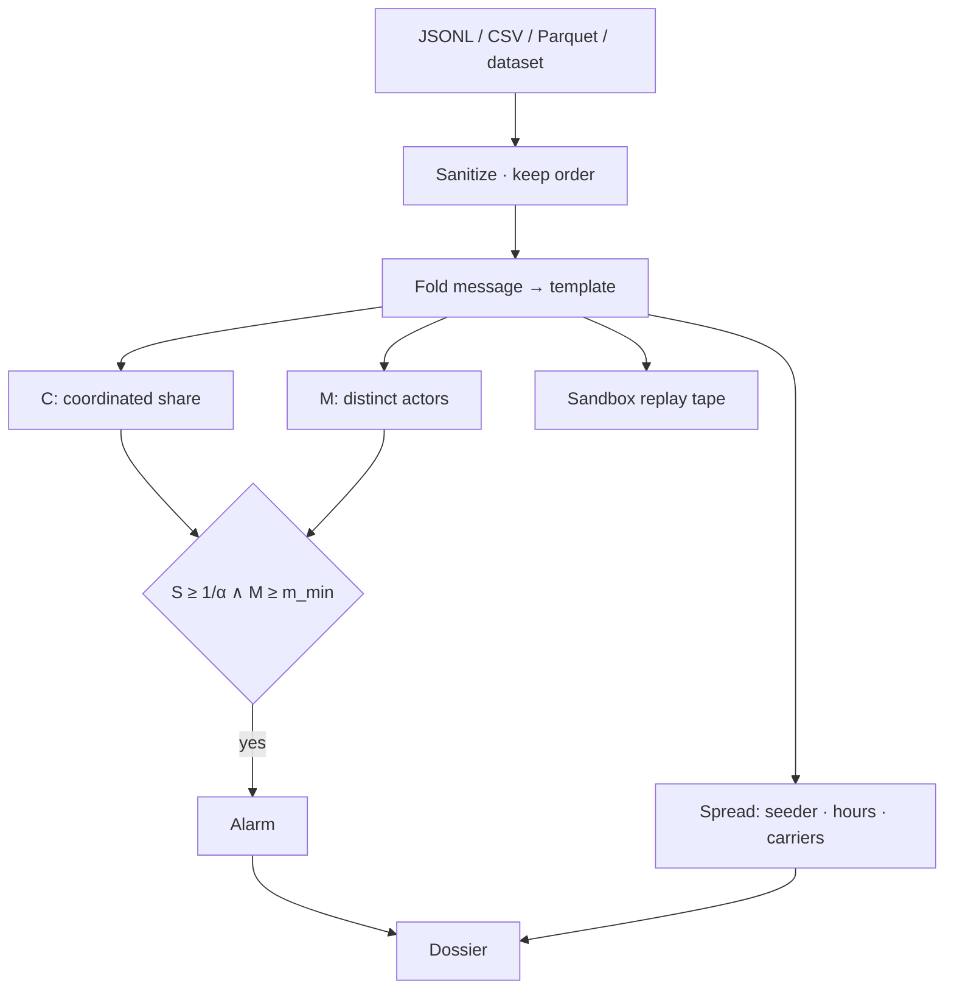

# kollude

**Swarm-collusion forensics for multi-agent logs.**

kollude reads agent speech (JSONL, CSV, Parquet, or a built-in corpus) and answers three questions a judge can check:

1. **Is this a swarm?** Many distinct actors copy a folded template (**M**), and that copying is a large share of the hour (**C**).
2. **When did it start?** An anytime-valid e-value (e-CUSUM) alarms only when both conditions hold, with false-alarm rate bounded by α under no change (Shin, Ramdas & Rinaldo, 2022).
3. **Who moved first?** `kollude spread` names the seeder, the hours until enough other actors copied the line, and who carried it.

One repository holds the Python detector, the HTTP/SSE API, MCP tools, and the investigator console. `kollude serve` runs API and UI together.

> Built for the [AI Village × Grove Research AI Swarm Dynamics Hackathon](https://swarmchasing.com). Solo submission: **Dhruva P Gowda**

---

## Quick start

Python **3.11+**. Node **20+** only if you want the console.

```bash
git clone https://github.com/dhruva137/kollude.git
cd kollude
pip install -e ".[dev]"
cd web && npm ci && npm run build && cd ..
kollude serve
```

Open **http://127.0.0.1:8787/** — landing page, then **Enter** into the console.

| Route | What you see |
|---|---|
| `#/` | **Landing** — brand + Enter |
| `#/sandbox` | **Sandbox** — world feed, rooms, agents coordinating, transcript, coordination speed |
| `#/live` | **Detector** — C · M · e-CUSUM stream, flock, dossier |
| `#/backtests` | Measured numbers vs baselines and intervals |
| `#/atlas` | Incident / dataset registry |

**Install the package:** `pip install kollude` (PyPI) once the release workflow has published. From a checkout: `pip install -e .` (add the web build steps below for the console).

### Docker (API + built console)

```bash
docker build -t kollude .
docker run --rm -p 8787:8787 kollude
```

---

## How it works



| Symbol | Meaning |
|---|---|
| **Template** | Folded text (URLs, digits, punctuation collapsed; prefix + suffix tokens) |
| **C** | Share of events on multi-actor templates in the bin |
| **M** | Mean distinct actors on those templates |
| **S** | e-CUSUM statistic; mixture over several ε |
| **Alarm** | Only if `S ≥ 1/α` **and** `M ≥ m_min` — never C alone, never M alone |
| **Spread** | First actor by time, hours until `min_actors` others, ordered carriers |

Dataset text is **untrusted**: never executed, never rendered as HTML, never followed as a URL.

---

## CLI

```bash
kollude demo                 # fixtures + self-check
kollude datasets list
kollude datasets fetch wiki  # public revision dump
kollude scan synthetic
kollude spread synthetic
kollude dossier synthetic
kollude attribute kollude/fixtures/failure.json
kollude watch path.jsonl     # tail a growing log
kollude mcp                  # MCP on stdin
kollude serve                # API + console → :8787
kollude backtest synthetic   # light local backtest
kollude stress --quick
```

Scan your own log:

```bash
kollude scan path.jsonl
```

Each row needs an **actor**, a **time**, and **text**. JSONL, JSON, CSV, and Parquet are accepted.

---

## Datasets

Files land in `./data` next to a checkout, or `$KOLLUDE_DATA` / `$KOLLUDE_HOME/data`.

| id | What | Laptop path |
|---|---|---|
| `synthetic` | Generated swarm, known onset | Always available · sandbox default |
| `forge` | Labelled FORGE episode, bundled in the package | Always available |
| `moltbook` | Agent social network (HF) | **Window only** by default: `2026-02-03`–`2026-02-09`. Full 1.7M posts need `--all` and several GB free |
| `wiki` | collusion.wiki revisions (German board) | `kollude datasets fetch wiki` |
| `village` | AI Village transcripts (text) | HF · optional `HF_TOKEN` · prefer a date window |

Sandbox buttons use the same safe windows. Do not load unbounded Moltbook on a laptop.

---

## API (local)

`kollude serve` → `http://127.0.0.1:8787`

| Method | Path | Purpose |
|---|---|---|
| GET | `/api/health` | version, runs |
| GET | `/api/datasets` | registry + availability |
| POST | `/api/runs` | `{dataset\|path\|events, start, end, max_rows, wait}` |
| GET | `/api/runs/{id}/stream` | SSE ticks / alarms |
| GET | `/api/runs/{id}/replay` | capped tape for the sandbox |
| GET | `/api/runs/{id}/spread` | seeder · hours · carriers |
| GET | `/api/runs/{id}/dossier` | structured answers |
| GET | `/api/runs/{id}/cluster/{tid}` | drill-down |
| POST | `/api/attribute` | who / which step failed (Who&When-style) |

Binds `127.0.0.1` by default. Pass `--host 0.0.0.0` only when you mean to expose it.

---

## What was measured

Every headline number has a **baseline** and an **interval**. Alerts need **M ∧ C**.

| Corpus | Result |
|---|---|
| **Moltbook** campaign (1,678,764 posts), marker unseen by the detector | Post AUROC **0.799** [0.798, 0.801] vs exact-dup 0.593 / volume 0.420 · Agent AUROC **0.913** [0.912, 0.915] vs 0.737 / 0.595 · First alarm **2026-02-05 12:00**, 12h before wave share crossed 20% |
| **collusion.wiki** | First alarm **2026-06-16 13:00**, **107h** before the 21 June IP landmark |
| **Who&When** hand-crafted | Agent accuracy **0.569** [0.441, 0.688] — loses to last-agent **0.603** (reported miss) |
| **Synthetic** (known onset) | Caught 2 bins after onset · post AUROC 1.000 vs volume 0.064 · one organic catchphrase can alarm before injected onset |
| **SwarmTraces** (91,037 payloads) | Folded templates reused across capture ids: 3,893 on ≥2 captures (86.2% of foldable payloads) vs exact-hash 1,899 / 7,553 payloads. No clock → no e-CUSUM |
| **Transluce** urlquery (37,649 included) | Actor axis absent → **0** alarms with the M gate. Class-share e-CUSUM with gate forced open would cross 3× (counterfactual only) |

---

## Math & research

- [MATH.md](MATH.md) — templates, $C$/$M$, mixture e-values, e-CUSUM, spread, attribution formulas as implemented.
- [RESEARCH.md](RESEARCH.md) — measured claims, named baselines, honest misses, and explicit non-claims.

---

## Repository layout

```
kollude/                 detector, CLI, HTTP/SSE API, MCP
  coord.py               templates, C, M
  stream.py              e-value · e-CUSUM
  spread.py              seeder · hours · carriers
  runs.py                run store · replay tape
  server.py              FastAPI
  bundled/ep001.json     forge episode
web/                     Vite + React console (HashRouter)
  src/views/SandboxView  world + rooms + transcript + speed
Dockerfile               multi-stage: npm build + pip install
tests/                   pytest
```

---

## Safety

- No `/data`, `.env`, weights, or raw Village dumps in git.
- FORGE / synthetic targets only for labelled wind-tunnel work.
- Public-feed watching (`kollude watch-url`) parses JSON as data: http(s), size-capped, no follow, no render.
- Do not sum automation + coordination + impact into one fake score.

---

## Author

**Dhruva P Gowda** · [@dhruva137](https://github.com/dhruva137)

Licensed under the **Apache License 2.0** — see [LICENSE](LICENSE) and [NOTICE](NOTICE). You can use and build on the code; you must keep attribution, and the patent grant stays with the project.
